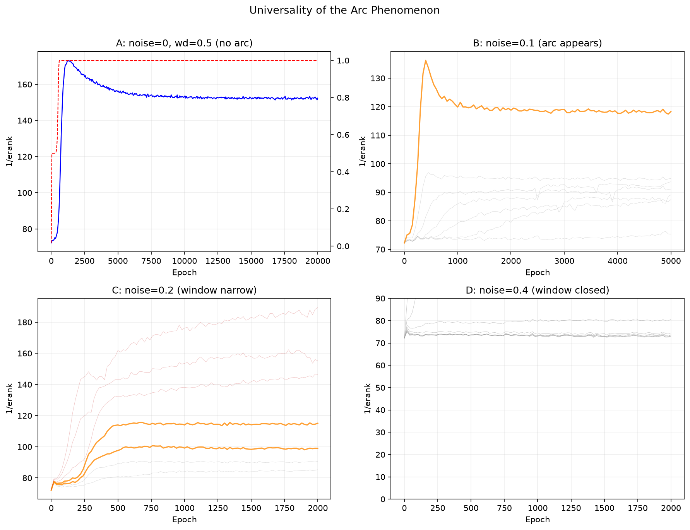

# Grokking Arc: Finding Generalization Without a Validation Set

[](LICENSE)

**When a neural network "grokks" — suddenly generalizing long after memorizing the training set — its hidden representations undergo a measurable collapse. We call the metric that captures this `erank`, and we show that its trajectory forms a predictable arc whose bottom signals the optimal moment to stop training — no validation set needed.**

## What is erank?

`erank` (effective rank) measures how many independent directions a model's hidden representation spans. Given an activation matrix `H [N × d]` from the first hidden layer, we compute its singular values `σ₁ ≥ σ₂ ≥ ...` and define:

```
pᵢ = σᵢ / Σⱼ σⱼ
erank = exp(-Σᵢ pᵢ · log pᵢ)
```

- **erank ≈ hidden_dim**: the model treats every sample independently (memorization)
- **erank ≪ hidden_dim**: the model discovers a low-dimensional structure (generalization)

It takes one line of PyTorch:
```python
U, S, V = torch.linalg.svd(H.float(), full_matrices=False)
erank = torch.exp(-(S/S.sum() * torch.log(S/S.sum()+1e-10)).sum()).item()
```

## Core Finding

On a controlled modular arithmetic task with injected label noise, erank traces an **arc**: it plunges as weight decay clears memorized patterns, then slowly rises as noise regenerates them. **The bottom of the arc is where the model generalizes best.**

### 1. Grokking Trajectory


Color code: **blue** = compression score (1/erank, higher = more compressed), **red** = test accuracy. With weight decay (wd=0.5), compression tracks generalization perfectly — both jump together. Without it (wd=0.0), nothing moves.

### 2. The Arc — Universality Across Noise Levels



Four panels, same MLP architecture, same task, same metric:

| Panel | Noise | Arc? | Best wd | Peak Accuracy |
|-------|-------|------|---------|---------------|
| A | 0% | No (monotonic) | 0.3 | 100% |
| B | 10% | **Yes** | 2.0–2.2 | 94.7% |
| C | 20% | **Yes** (narrow window) | 2.0–2.2 | 94.7% |
| D | 40% | **No** (window closed) | — | 30% |

Orange curves = arc region. Gray = under-decayed (no compression). Red = over-decayed (collapsed). **The arc is not a fluke — it appears at every noise level where grokking is possible, and disappears precisely when grokking becomes impossible.**

### 3. Compression vs Noise


As label noise increases, the model's compression ability collapses — not gradually, but through a window that snaps shut between 20% and 40% noise.

## Why This Works: Mechanism

### Weight decay as a differential filter

Every training step: `θ ← θ·(1-ηλ) - η·∇L`. Weight decay shrinks all parameters equally. But:

- **Algorithmic params** (encoding the addition rule): pushed by gradients from 500 clean samples every epoch → pushed back faster than decay
- **Memorization params** (recalling specific samples): pushed by at most one sample → pure decay kills them

No metaphors, just arithmetic. The parameters that survive are the ones with the broadest gradient support.

### Noise creates the arc

Clean data: decay clears noise-free memorization params. They stay dead. No arc — monotonic compression.

Noisy data: decay clears memorization params → erank drops (algorithm emerges). But noise samples randomly push wrong labels → random walk regenerates ghost params → erank rises. **Arc = race between decay and random regeneration.**

## Quick Start

```bash
pip install torch numpy matplotlib
python src/run.py --mode grok --device cuda    # grokking trajectory
python src/run.py --mode arc --device cuda      # arc discovery scan
python src/run.py --mode noise --device cuda    # noise scan
python src/plot.py                              # regenerate figures
```

## Data

`data/` contains complete training trajectories with per-checkpoint erank:

| File | Experiment |
|------|-----------|
| `grokking_trajectory.json` | Full grokking run (20000 epochs, 401 snapshots) |
| `arc_discovery_noise01.json` | Noise=10% wd scan — **arc first discovered here** |
| `arc_high_wd_noise01.json` | Noise=10% high wd (2.0/3.0/5.0) comparison |
| `arc_window_noise02.json` | Noise=20% wd 1.5–3.0 — window narrowing |
| `arc_optimal_noise02.json` | Noise=20% wd 2.0–2.2 — optimal point |
| `arc_broad_noise02.json` | Noise=20% wd 0.1–2.0 broad scan |
| `arc_noise04_closed.json` | Noise=40% wd scan — **window closed** |
| `noise_scan.json` | Noise 0%–40% erank comparison |
| `dim_scaling.json` | Width scaling (dim 32–256) |
| `dim256_long.json` | Dim 256 long training (20000 epochs) |

## Reference

Independent work converging on rank-based order parameters for grokking:
- Wang (2026): *Grokking as Dimensional Phase Transition*
- ERI Labs (2026): *Fisher Rank Crystallization*
- DeMoss et al. (2024): *Complexity Dynamics of Grokking*
