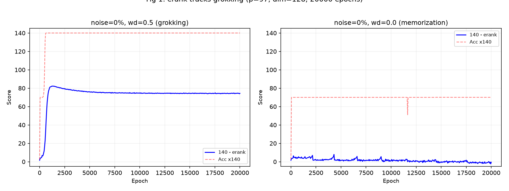
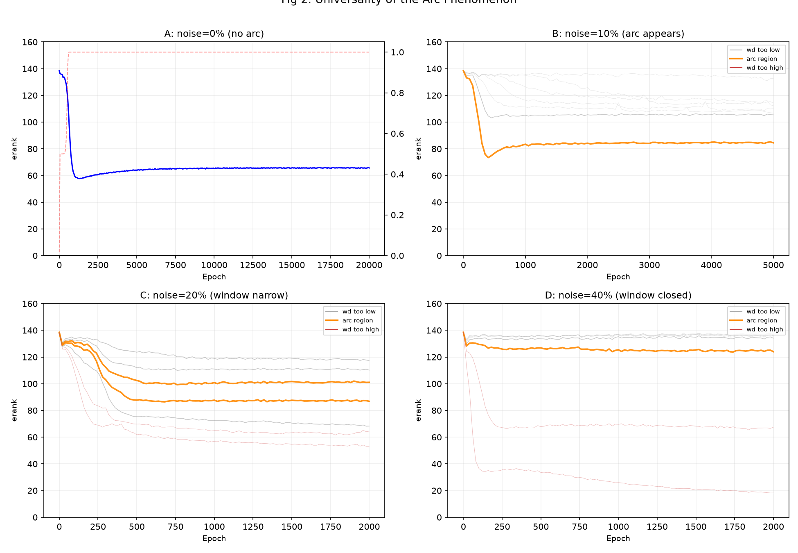
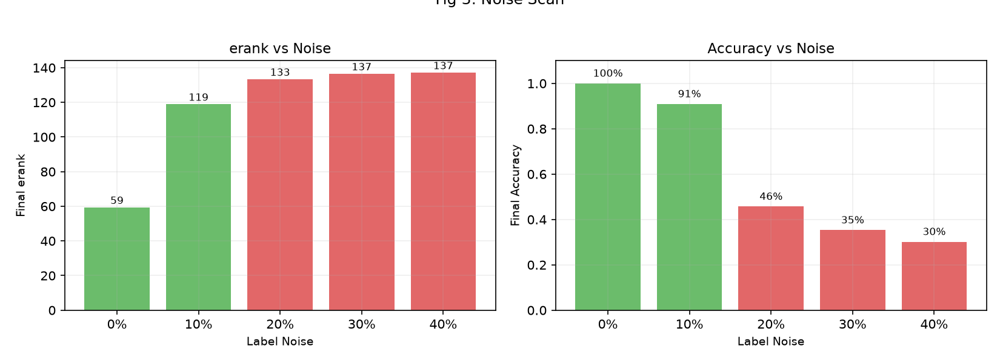
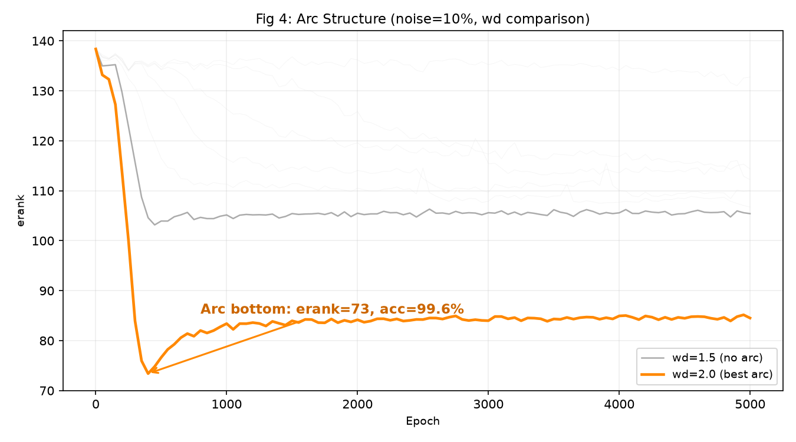

# Grokking Arc: 无需验证集的泛化检测

[](LICENSE)

**当神经网络发生"顿悟"——在完全背下训练集后突然开始泛化——它的隐藏表示会发生可测量的维度塌缩。我们把这个指标叫 `erank`，它的轨迹会形成可预测的弧形，弧底就是最佳停止点。**

## erank 是什么

`erank`（有效秩）测量隐藏层表示占据了多少独立方向。取第一隐藏层的激活矩阵 `H [N × d]`，做 SVD 得到奇异值 `σ₁ ≥ σ₂ ≥ ...`：

```
pᵢ = σᵢ / Σⱼ σⱼ
erank = exp(-Σᵢ pᵢ · log pᵢ)
```

- **erank ≈ hidden_dim**（高）：每个样本独占比一个方向 → 记忆态
- **erank ≪ hidden_dim**（低）：表示压缩到少数方向 → 泛化态

一行 PyTorch 搞定：
```python
_, S, _ = torch.linalg.svd(H.float(), full_matrices=False)
erank = torch.exp(-(p := S/S.sum() * torch.log(p+1e-10)).sum()).item()
```

## 实验设置

所有实验在完全可控的合成任务上进行：

```
任务:    (a + b) % p   —— 模加法（p=97）
模型:    2层 MLP (embed=128, hidden=256)
数据:    训练集 50% 的 pair（~4700 样本），测试集全部 9409 个 pair
噪声:    随机篡改训练标签——label_noise_ratio 比例的标签被替换为随机错误
优化:    AdamW, lr=0.001, batch=512
变量:    weight_decay (0.0-5.0), label_noise_ratio (0%-40%), dim (32-256)
指标:    每 50 步记录 train_loss, test_acc, erank
```

**我们变化了什么：**

| 实验 | 固定参数 | 变量 | 目的 |
|------|---------|------|------|
| Grokking 全轨迹 | noise=0, wd=0.5 | epoch (20000) | 观察完整的记忆→泛化过程 |
| 噪声扫描 | wd=0.5 | noise=0%/10%/20%/30%/40% | noise 如何扼杀 grokking |
| 弧形发现 | noise=10% | wd=0.1-3.0 | 找到产生弧的 wd 区间 |
| 窗口测量 | noise=20% | wd=1.5-3.0 | 高噪声下窗口如何收窄 |
| 窗口顶点 | noise=20% | wd=2.0-2.2 | 精确找到最优 wd |
| 标度实验 | noise=0, wd=0.5 | dim=32/64/128/256 | 模型大小对压缩的影响 |

## 核心发现

### 1. 有 weight decay 才顿悟，无则不泛化



蓝线 = 140 - erank（反转，越高表示越压缩），红线 = 测试准确率 × 140。左图：wd=0.5 下，两条曲线同步上升——erank 从 138 骤降到 60（反转后从 2 升到 80），测试准确率同时从 2% 跳到 100%。右图：wd=0.0 下，两条线都纹丝不动。

### 2. 弧形是普适现象



四张子图，同一任务、同一架构、同一指标。橙线 = 弧形区间：

| 子图 | 噪声 | 弧形？ | 最优 wd | 峰值准确率 |
|------|------|--------|---------|-----------|
| A | 0% | 无（单调下降） | 0.3 | 100% |
| B | 10% | **有** | 2.0-2.2 | 94.7% |
| C | 20% | **有（窗口极窄）** | 2.0-2.2 | 94.7% |
| D | 40% | **无（窗口关闭）** | — | 30% |

灰色 = wd 过小（压不住噪声），红色 = wd 过大（压死算法参数）。弧形只在甜点区间出现，且随噪声增大迅速收窄直至消失。

### 3. 噪声越高，压缩越难



噪声=0% 时 erank 降为 59（高度压缩），噪声=10% 时停在 119，噪声≥20% 时完全无法 grok。

### 4. 弧底 = 最佳泛化点



noise=10% 下三条典型曲线对比：wd=1.5 无弧（压缩不足），wd=2.0 出现清晰弧形（弧底 erank=99, acc=86%），wd=3.0 直接塌死。弧底是模型最紧凑、泛化最好的瞬间——早停信号。

## 原理：为什么会有弧形

**Weight decay 作为微分过滤器。** `θ ← θ·(1-ηλ) - η·∇L`。所有参数被平等衰减，但反抗能力不同：

- **算法参数**（编码模加法规则）→ 被数百个干净样本的共享梯度反复推 → 推回力 > 衰减力 → 幸存
- **记忆参数**（服务特定样本）→ 只被单个样本偶尔推 → 纯衰减致死

**噪声制造弧形。** 噪声标签随机推错误方向 → 随机游走干扰 ∝ √(noise·t)。干净信号线增长 ∝ (1-noise)·t。短期 wd 清空记忆参数（erank ↓），长期随机游走噪声再生幽灵参数（erank ↑）。弧形 = wd 衰减和噪声再生之间的拔河。

**弧形窗口存在的条件：** `(1-noise)·g_clean > √(noise/t)·g_noise + λ`。当 noise 过大（≈30-40%）时无解——窗口关闭。

## 快速开始

```bash
pip install torch numpy matplotlib

# 追踪 Grokking 全轨迹
python src/run.py --mode grok --device cuda --epochs 20000

# 弧形扫描
python src/run.py --mode arc --device cuda

# 噪声扫描
python src/run.py --mode noise --device cuda

# 重新生成图表
python src/plot.py
```

## 数据

`data/` 目录包含全部实验的训练轨迹：

| 文件 | 实验内容 |
|------|---------|
| `grokking_trajectory.json` | Grokking 全追踪 (20000 epochs) |
| `arc_discovery_noise01.json` | Noise=10% wd 扫描 —— **弧形首次发现** |
| `arc_high_wd_noise01.json` | Noise=10% 高 wd (2.0/3.0/5.0) 对比 |
| `arc_window_noise02.json` | Noise=20% wd 1.5-3.0 精细扫描 |
| `arc_optimal_noise02.json` | Noise=20% wd 2.0-2.2 最优定位 |
| `arc_broad_noise02.json` | Noise=20% wd 0.1-2.0 宽扫描 |
| `arc_noise04_closed.json` | Noise=40% wd 扫描 —— **窗口已关闭** |
| `noise_scan.json` | Noise 0%-40% erank 分化 |
| `dim_scaling.json` | Dim 32-256 标度实验 |

## 相关工作

用秩/维度作为 grokking 序参量的独立工作：
- Wang (2026): *Grokking as Dimensional Phase Transition* — 梯度场维度 D
- ERI Labs (2026): *Fisher Rank Crystallization* — Fisher 秩分数 r/n
- DeMoss et al. (2024): *Complexity Dynamics of Grokking* — 压缩复杂度
