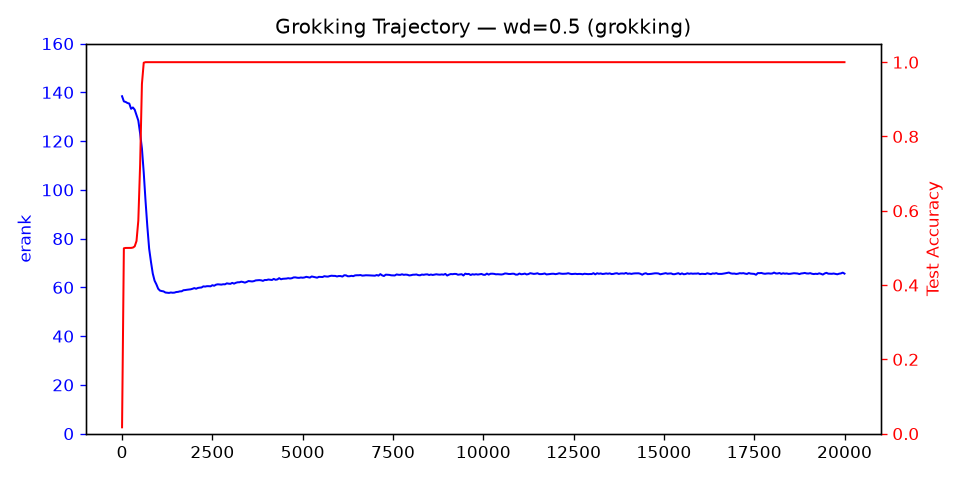
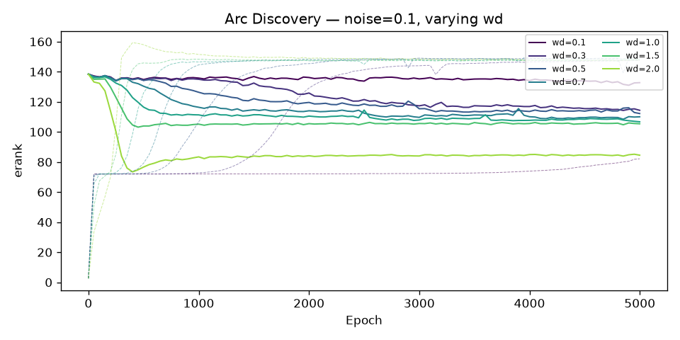
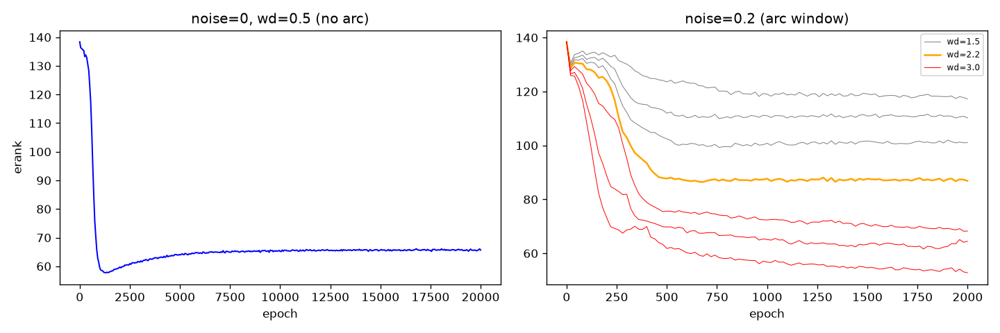
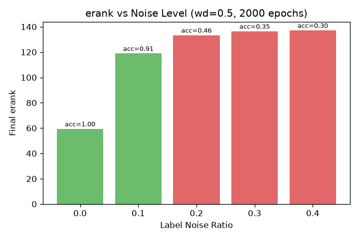

# Grokking Arc: erank as an Order Parameter and Training Stop Signal

[](LICENSE)

**erank（激活矩阵有效秩）能够在 grokking 发生前检测到相变，并在最优泛化点给出停止信号——不需要验证集，不需要看 loss。**

## Core Finding

在带标签噪声的模加法任务上训练 MLP，erank 的轨迹呈现**弧形结构**：先骤降（记忆参数被 wd 清空，算法表示浮现），后回升（噪声样本缓慢再生记忆参数）。弧底 = 模型最紧凑且泛化最好的时刻。

### Grokking Trajectory (noise=0)



wd=0.5 下 erank 从 138 降到 60。wd=0.0 下纹丝不动。

### Arc Discovery (noise=0.1)



噪声=0.1 下，wd=2.0 首次出现弧形——erank 先降后升。wd=0.1-1.0 过滤不足，wd=3.0 压死一切。

### Arc Window (noise=0 vs noise=0.2)



左：noise=0，无弧（单调解降）。右：noise=0.2，弧形窗口极窄，只有 wd≈2.2 产生弧。

### Noise Scan



erank 在 noise=0 时从 138 降为 59，noise=0.1 时停在 119，noise≥0.2 时无法 grok。

## Key Results

### 1. erank 是有效的非平衡序参量
- Grokking 中从 138 降到 60（55% 压缩）
- 与同期前沿（Wang 2026, ERI Labs 2026）独立收敛到秩作为序参量

### 2. 弧形理论
- 噪声 > 0 时才出现弧（erank 先降后升）
- 弧底 = 最佳泛化点（早停可多拿 4-6% acc）
- 无噪声时只有单调解降 + 微弱的过衰减尾迹

### 3. 弧形窗口随噪声收窄
| noise | arc window | peak acc |
|-------|-----------|----------|
| 0.0   | no arc (monotonic) | 100% |
| 0.1   | wd 2.0-2.2 | 94.7% |
| 0.2   | wd 2.0-2.2 (very narrow) | 94.7% |
| 0.4   | window closed | 30% |

### 4. Weight Decay as Differential Filter
算法参数被多个干净样本共享 → 梯度密集推回 → 抵抗衰减。记忆参数只有专属样本偶尔推一次 → 纯衰减致死。噪声样本持续再生记忆参数 → 产生弧。

## Quick Start

```bash
pip install torch numpy
python src/run.py --mode grok --device cuda           # grokking trajectory
python src/run.py --mode arc --device cuda             # arc detection
python src/run.py --mode noise --device cuda           # noise scan
```

## Data

`data/` 包含全部实验的完整轨迹：

| File | Experiment |
|------|-----------|
| `grokking_trajectory.json` | Grokking 完整追踪 (20000 epochs, 401 snapshots) |
| `noise_scan.json` | Noise 0.0-0.4 下 erank 分化 (固定 wd=0.5) |
| `arc_discovery_noise01.json` | Noise=0.1 wd 扫描 —— **弧形首次发现** |
| `arc_high_wd_noise01.json` | Noise=0.1 高 wd (2.0/3.0/5.0) 弧线对比 |
| `arc_window_noise02.json` | Noise=0.2 wd 1.5-3.0 精细扫描 —— 窗口收窄 |
| `arc_optimal_noise02.json` | Noise=0.2 wd 2.0-2.2 最优区间定位 |
| `arc_broad_noise02.json` | Noise=0.2 wd 0.1-2.0 宽扫描 |
| `arc_noise04_closed.json` | Noise=0.4 wd 扫描 —— **窗口已关闭** |
| `dim_scaling.json` | Dim 32/64/128/256 标度实验 |
| `dim256_long.json` | Dim=256 20000 epochs 长训练 |

## Theory

**Core mechanism, no deep metaphors needed:**

1. **Cross-entropy degeneracy**: softmax gradient `∂L/∂f = p - 1_{correct}` never reverses sign. Without regularization, weights grow unboundedly.

2. **Weight decay as differential filter**: `θ ← θ·(1-ηλ)`. Algorithmic params survive (many samples push back). Memorization params die (no pushback).

3. **Noise as regeneration force**: noisy samples push random wrong directions → random walk interference ∝ √(noise·t). Clean signal grows ∝ (1-noise)·t. Their competition defines the arc.

4. **Arc window**: exists only when `(1-ε)·g_clean > √(ε/t)·g_noise + λ`. Window closes at ε ≈ 0.3-0.4.

## Reference

Independent work converging on rank-based order parameters:
- Wang (2026): *Grokking as Dimensional Phase Transition* — gradient field dimension D
- ERI Labs (2026): *Fisher Rank Crystallization* — Fisher rank fraction r/n
- DeMoss et al. (2024): *Complexity Dynamics of Grokking* — compression complexity
